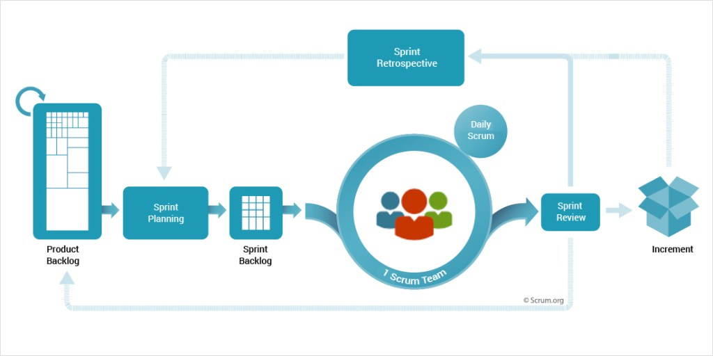
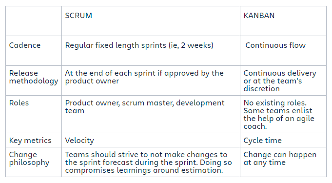

# Agile, SCRUM and Kanban
## Agile
**What are the 4 principles?**
1. Individuals and Interactions over Process and Tools
2. Working software over comprehensive documentation
3. Customer collaboration over contract negotiation
4. Responding to change over following a plan

## SCRUM
- SCRUM is a framwork that helps teams work together. Much like a rugby team training for the big game, SCRUM encourages teams
to learn through experiences, self-organise while working on a problem, and reflect on their wins and losses to continously improve.
- Scrum is very similar to Agile, it is based on continous learning and adjustment to fluctuating factors. 
- **Trello is Sparta's way of implementing SCRUM for their courses**
### Scrum Roles
1. Scrum Product Owner - are the champions for their product. They are focused on understanding business, customer and mark 
requirements, then prioritising the work to be done by the engineering team accordingly. 
- They:
  - They build and manage the product backlog
  - Closely partner with the business and the team to ensure everyone understands the work items in the product backlog
  - Give the team clear guidance on which features to deliver next
  - Decide when to ship the product

2. Scrum master - are the champions for scrum within their teams. They coach teams, product owners, and the business on the scrum
process and look for ways to fine-tune their practice of it.
- Its:
  - An effective scrum master deeply understands the work being done by the team and can help the team optimise their transparency
and delivery flow. They are in charge of scheduling people to do sprint planning, standu-up, sprint review and retrospective. 

3. Scrum development team - they get stuff done, champions for sustainable development practices. Usually 5-7 members or small
enough to share two pizzas. Different skillsets continously develop their skills, all help eachother to reach the common goal
of completing the sprint. Deliver the plan for each sprint and forecast how much work they believe they can complete over the
iteration length. 

### Scrum Ceremonies

1. Organise the backlog - Responsibility of the product owner, the first thing that takes place in a scrum. They oversee the project
and make sure that it reaches its product vision and have a constant pulse on the market and the customer. This is maintained
using feedback from users and dev team to help prioritise and keep the list clean and ready to be worked on at any given time.

2. Sprint planning - This meeting is used to understand the work to be performed (scope) during the current sprint by the entire
dev team. Led by the scrum master and is where the team decides on the sprint goal. Specific user stories are then added to the 
sprint from the product backlog to ensure the goal is delivered on time. At the end everyone will be clear on what to do during 
each sprint.

3. Sprint - Actual time period when the scrum team works together to finish an increment. Two weeks is a pretty typical
length for a sprint though it varies. During this period the scope can be re-negotiated between the product owner and the 
development team if necessary. **All events  - from planning to retrospective happen during the sprint.** Once a certain interval
is decided, it should remain consistent through the entire development period so the team can learn from past experiences.

4. Daily Scrum or Stand-up - Daily super-short meeting that happens at the same time (morning) and place to keep it simple. Teams
try to compelte this in 15 mins with the goal for everyone on the team to be on the same page, aligned with the sprint goal, and to
get a plan out for the next 24 hours. **Time to voice any concerns you have with meeting the sprint goal or any blockers**

5. Sprint Review - At end of sprint the team gets together for an informal session to view a demo of, or inspect the increment. 
The development team showcases the backlog items that are now 'Done' to stakeholders and teammates for feedback. Product owner
decides whether to release the increment although in most cases the increment is released. Backlog can be reworked during this
which can feed into the next sprint planning session. Usually takes 4 hours.

6. Sprint retrospective - Where the team comes together to document and discuss what worked and what didn't work in a sprint, a 
project, people or relationships, tools or even for certain ceremonies. The idea is for the team to focuson what went well, and 
what needs to be improved for the next time and less about what went wrong. 

### Scrum Artifacts 
1. Product Backlog - The master list of work that needs to get done maintained by the product ownder or manager. Dynamic list 
of features, requirements etc... that acts as the input for sprint backlog. Essentially the teams "TO DO" list. It is constantly
revisited re-prioritised and maintained by the Product Owner.

2. Sprint Backlog - List of items, user stories, or bug fixes selected by the development team for implementation in the current
sprting cycle. Before each sprint, in the planning meeting the team chooses which items it will work on for the sprint from
the product backlog. A sprint backlog may be flexible and can evolve during a sprint. However, the fundamental sprint goal -
what the team wants to achieve from the current sprint - cannot be compromised. 

3. Increment (or Sprint Goal) - the usable end-product from a sprint. At Atlassian, we usually demonstrate the "increment" during
the end-of-sprint demo, where the team shows what was compelted in the sprint. It is entirely the decision of the team whether to
ship their product at the end of sprints or not, it is dependent on what the team defines as 'Done'.

### 3 Amigos
Refers to the primary perspectives to examine an increment of work before, during and after development:
- Business - What problem are we trying to solve?
- Development - How might we build a solution to solve that problem?
- Testing - What about this, what could possibly happen?

## Epic & User Stories
### User Stories
When consulting with a client or product owner, the team divides the work to be done into functional increments called "user stories"
Each user story is expected to yield, once implemented, a contribution to the value of the overall product, irrespective of the order
of implementation.

**Example:** Trello cards, each card is a user story which when completed contributes to the overall DevOps education. 

**SCRUM** - Every morning user cards are generated and moved around to show tasks needing to be done and ones that were finished.

**Agile** - Repeating the process on Trello means that we are constantly evaluating what tasks need to be done and which ones not.
Process can be repeated for every new development project

Benefits include:
- Reducing the risks of delay, especially if the increments are small and software is released frequently.
- Client has the option to change the order of tasks.
- Developers can see exactly what they are doing thus promoting efficiency and discipline as well as reducing stress. 

**INVEST** - Helps to remember a widely accepted set of criteria or checklist to assess the quality of a user story. If the story
fails to meet one of these criteria the team may want to reword it or even consider a rewrite. A good user story should be:
- I  Independent (of all others)
- N  Negotiable (not a specific contract for features)
- V  Valuable 
- E  Estimable (to a good approximation)
- S  Small (so as to fit within an iteration)
- T  Testable (in principle, even if there isnt a test for it yet)

**Planning Poker** - An agile estimating and planning technique that is consensus based. To start a poker session, the product 
ownder or customer reads an agile user story or describes a feature to the estimators. Everyone essentially picks up cards which
they think show the correct estimate for the story. If everyone picks the same card, that is the estimate, if people have 
differing opinions, the process is repeated until people share the same estimate.

### Epic User Stories
An epic is a large user story that cannot be delivered as defined within a single iteration or is large enough that it can be split
into smaller user stories.
Epic stories allow you to keep track of large, loosely defined ideas in your backlog without the need to overpopulate your backlog
with multiple items. The team will most likely split an epic user story into smaller user stories to make development much 
more efficient and understandable. 

**Example:** - Backing up an entire hard drive (EPIC STORY). The task is too large for an agile team to complete in one iteration
, it is split into multiple smaller user stories before being worked on (could be split into dozens of stories) - As a user
i can specify files or folders to backup based on file size. As a user I can indicate folders not to backup so that my backup
drive isn't filled up with things I don't need saved. 

**SCRUM** - Concept of epics is particularly useful when you are following SCRUM as it has explicit timeboxed iterations (sprints).
Most of the time will organise work into 2 - 4 week sprints.

**Agile** - Splitting large epic user stories/tasks into more manageable smaller user stories and doing iterations (i.e design,
work/develop and test to make sure it worked) 

Benefits:
- Reduces stress placed on a team to complete a project which is very complex as its broken down into more manageable user stories
- Improves efficiency as developers know exactly how to approach a project when its broken down 

## Kanban
Kanban is a popular framework used to implement agile software development. IT requires real-time communication of capacity and 
full transparency of work. Work items are represented visually on a kanban board, allowing team members to see the state of every
piece of work at any time. 

The work of all kanban teams revolves around a **kanban board**, a tool used to visualise work and optimise the flow of the work
among the team. Virtual boards are a crucial feature in any agile software development tool for their traceability, easier 
collaboration and accessibility from multiple locations. A basic kanban board has a 3 step workflow: **To Do, In Progress and Done**.
It is an incredibly useful tool as everyone on the development team can see what everyone else is working on and it makes workflow
much more efficient as there is a large decrease in confusion and issues with not knowing what to do.  

### Kanban vs SCRUM

Kanban is great for teams that have lots of incoming requests that vary in priority and size. Whereas scrum processes require
high control over what is in scope, kanban let's you go with the flow. One major difference between the two is that there is no
one assigned to be the "kanban master" so everyone can change and alter the workflow as well as change the estimates for the 
different cards to be delivered. 

SCRUM forces the team to ship some valuable increment of work by the end of each sprint. Scrum is built on empiricism, focusing
on small increments of work that will help you learn from your customers and better inform what you do next. 
